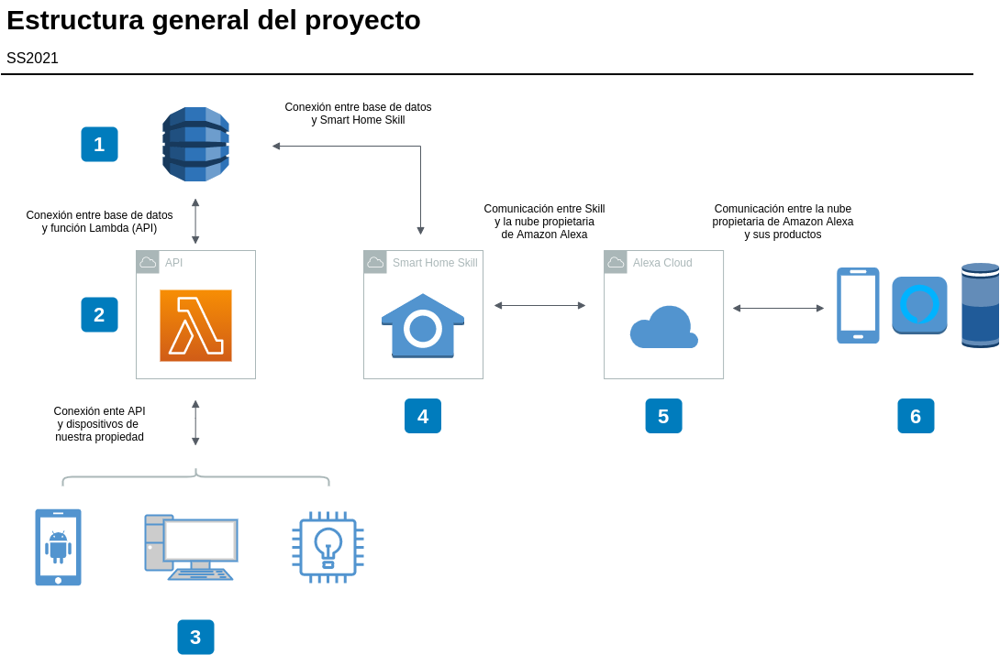
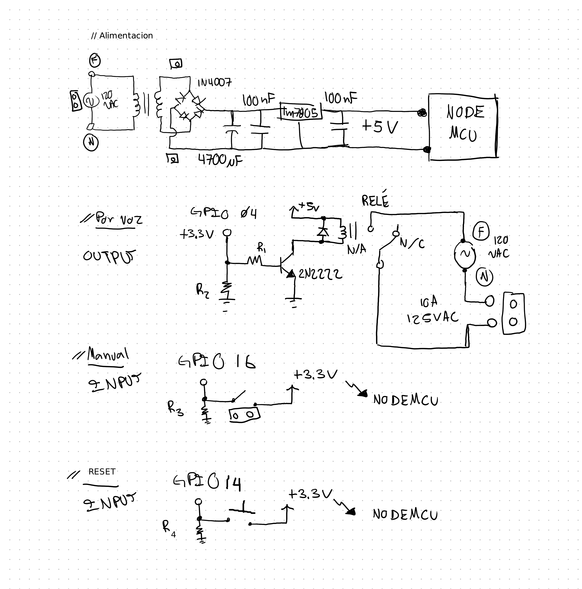
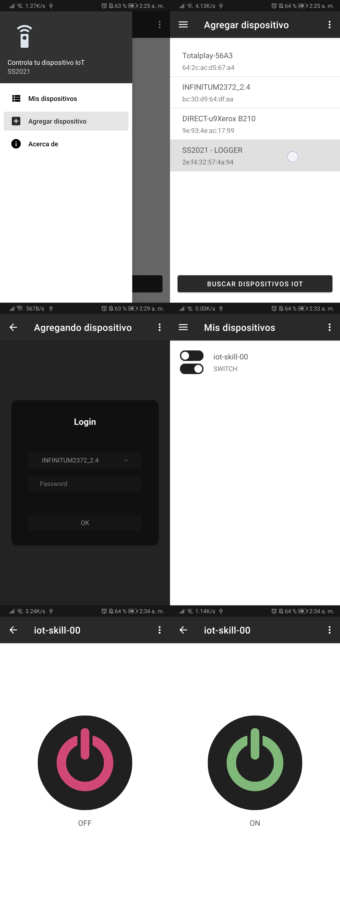
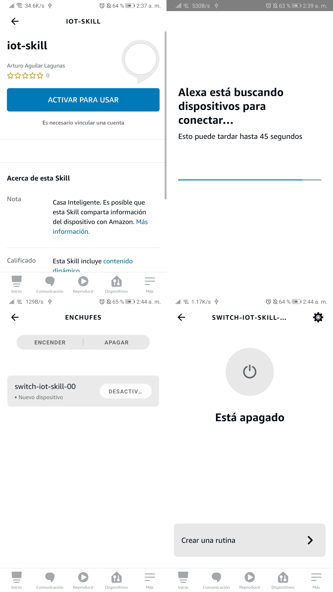

# Servicio Social (2021)
*Tecnológico Nacional de México | Campus Veracruz*
## Índice:
- __Software__
  - Aplicacion móvil (Android)
    - IoTDeviceApp
  - Aplicacion de escritorio
    - Sitio web (local)
  - Microcontrolador
    - IoTDevicePlus
  - API
  - AlexaSkill
  - Base de datos
- __Esquemas__
  - Diagrama del proyecto
  - Diagrama de flujo
  - Circuito electrónico
  - Base de datos
- __Manuales__
  - Usuario (Instructivo)
  - Técnico / Prácticas
## Esquemas
### Diagrama del proyecto

### Diagrama de flujo para el microcontrolador  

  

  

### Circuito electrónico
  

### Base de datos  

  

  

## Vista previa
|Aplicación móvil (Android)|
|:-|
||

|Aplicación móvil (Alexa)|
|:-|
||

|Sitio web local (Alexa)|
|:-|
||
____
#### *Tecnológico Nacional de México | Campus Veracruz*
